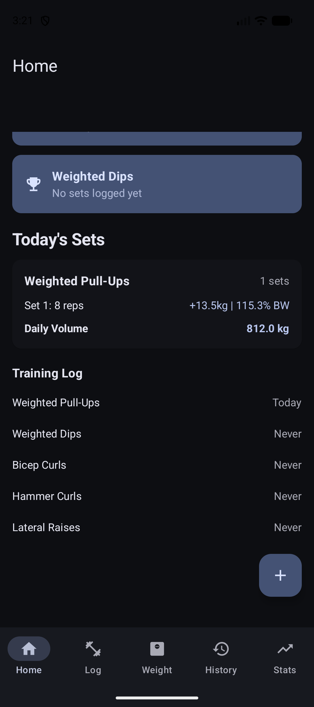
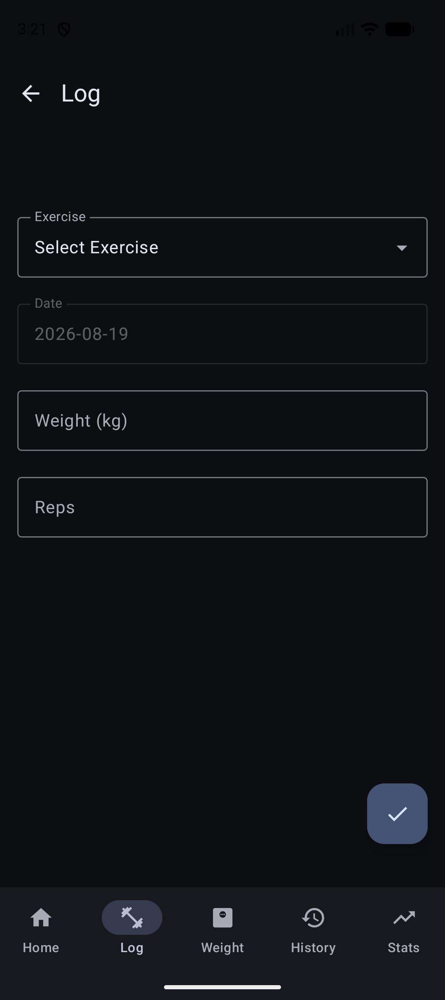
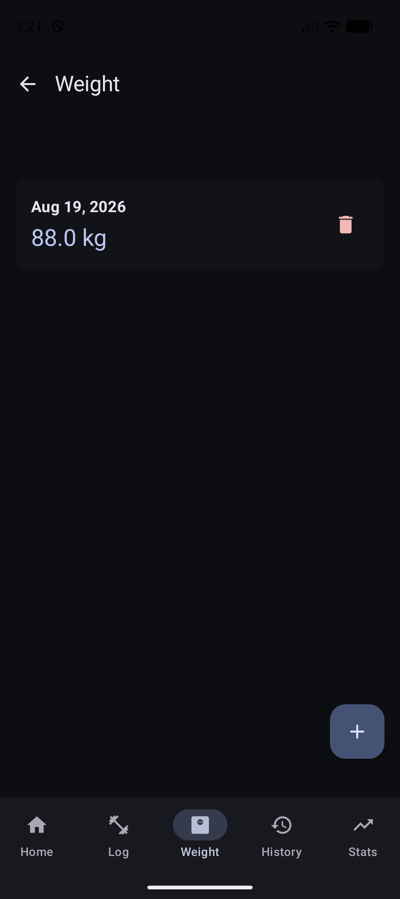
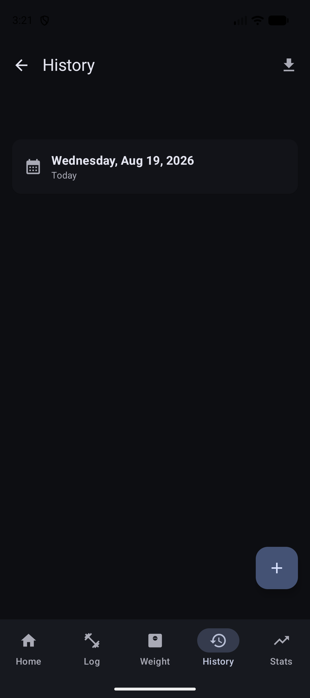
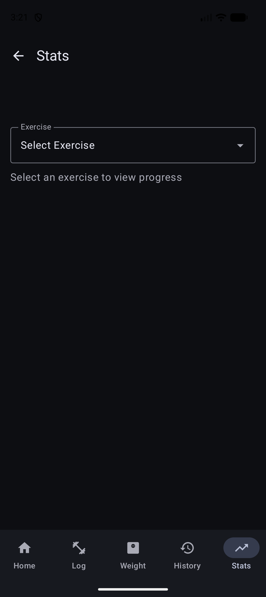

# Tr3ack

A workout tracker Android app for logging strength-training sessions, tracking body weight, and visualizing progress over time. Built for weighted calisthenics — pull-ups, dips, chin-ups — and free weight exercises.

## Screenshots

<p align="center">
  
  &nbsp;&nbsp;
  
  &nbsp;&nbsp;
  
</p>
<p align="center">
  
  &nbsp;&nbsp;
  
</p>

## Features

- **Dashboard** — At-a-glance view of today's body weight, personal bests, and recent activity
- **Log Workouts** — Select exercise, set reps/weight, pick any date for backfilling; weight persists between sets for fast logging
- **Body Weight Tracking** — One entry per day, editable, with fallback lookup for workout days without a log
- **Personal Record Card** — Single best-set record per exercise, selected by highest estimated 1RM across all logged sets; shows e1RM, set, total system load, % BW, and date achieved
- **Estimated 1RM Card** — Calculated from the set with the highest estimated 1RM using movement-specific coefficients; includes BW multiplier, working loads (85/80/75%), and added weight needed at current BW
- **3 Progress Charts** (5/10 day toggle):
  - **Estimated 1RM** — Line chart with gradient fill showing strength trend over time
  - **Session Tonnage** — Bar chart of total work capacity (kg·reps) for deload detection
  - **Belt Load vs Body Weight** — Dual-line chart showing relative strength gains during cuts/bulks (bodyweight exercises only)
- **History** — Browse all logged sessions by date, edit or delete any past set
- **CSV Export** — Export all workout data as a formatted CSV file from the History screen
- **JSON Backup & Restore** — Full data backup/restore from the Dashboard overflow menu; exports editable JSON file containing all exercises, sets, and body weight entries
- **Splash Screen** — Custom branded launch screen with app icon
- **Dark Mode** — Always-on dark theme

## Exercises

| Exercise          | ID | Type                | Tracked Metrics                                      |
| ----------------- | -- | ------------------- | ---------------------------------------------------- |
| Weighted Pull-Ups | 1  | Weighted bodyweight | E1RM, Tonnage, Belt vs BW, System weight, % BW      |
| Weighted Dips     | 2  | Weighted bodyweight | E1RM, Tonnage, Belt vs BW, System weight, % BW      |
| Weighted Chin-Ups | 3  | Weighted bodyweight | E1RM, Tonnage, Belt vs BW, System weight, % BW      |
| Bicep Curls       | 4  | Free weight         | E1RM, Tonnage, Weight x reps                         |
| Hammer Curls      | 5  | Free weight         | E1RM, Tonnage, Weight x reps                         |
| Lateral Raises    | 6  | Free weight         | E1RM, Tonnage, Weight x reps                         |

## Stats — How E1RM Works

### Bodyweight Exercises (Pull-Ups, Dips, Chin-Ups)

Uses movement-specific coefficient tables to convert multi-rep performance into an estimated 1RM:

```
E1RM = TSL × coefficient(reps)
```

Where `TSL = Body Weight + Added Weight` and the coefficient varies by exercise and rep count:

| Reps | Dips   | Pull-Ups | Chin-Ups |
| ---- | ------ | -------- | -------- |
| 1    | 1.000  | 1.000    | 1.000    |
| 2    | 1.035  | 1.038    | 1.042    |
| 3    | 1.068  | 1.073    | 1.082    |
| 4    | 1.100  | 1.108    | 1.120    |
| 5    | 1.130  | 1.142    | 1.158    |
| 6    | 1.160  | 1.175    | 1.194    |
| 7    | 1.190  | 1.208    | 1.229    |
| 8    | 1.220  | 1.240    | 1.263    |
| 9    | 1.250  | 1.272    | 1.296    |
| 10   | 1.280  | 1.304    | 1.328    |

Chin-up coefficients are higher than pull-ups because the bicep provides a leverage advantage, allowing more load at the same rep count.

### Free Weight Exercises

Uses the Epley formula:

```
E1RM = Weight × (1 + Reps / 30)
```

## Stats — Other Charts

- **Session Tonnage** = Sum of (TSL × Reps) across all sets in a session. Tracks total work capacity — useful for identifying overtraining or verifying volume before a deload.
- **Belt Load vs Body Weight** — Plots added weight (belt load) and body weight on the same axis over time. During a cut, the belt load line rising while body weight drops = improving relative strength.

## CSV Export

Export your data from the History screen (download icon in the top bar). The CSV includes:

| Column | Description |
| --- | --- |
| Date | Workout date |
| Exercise | Exercise name |
| Added Weight (kg) | Average weight added across sets |
| Total System Weight (kg) | Body Weight + Added Weight (or just weight for free weight) |
| % of Body Weight | Total System Weight / Body Weight × 100 |
| Reps | Reps per set (e.g. 8-7-6) |
| Volume (kg) | Sum of (Total System Weight × Reps) |

## JSON Backup & Restore

Full data backup available from the Dashboard overflow menu (⋮). Exports a `Tr3ack_Backup_<date>.json` file containing all exercises, workout sets, and body weight entries. The file is human-readable and hand-editable — open it in any text editor to tweak values before re-importing.

| Section | Fields |
| --- | --- |
| `meta` | version, export date, record counts |
| `exercises` | id, name, isBodyweightBased |
| `workoutSets` | id, exerciseId, date, addedWeightKg, reps, timestamp |
| `bodyWeightEntries` | id, date, bodyWeightKg |

Importing a backup replaces all current data. A confirmation dialog is shown before restore.

## Key Metrics

- **Total System Weight** = Body Weight + Added Weight
- **% Body Weight** = (Total System Weight / Body Weight) × 100
- **Estimated 1RM** = Movement-specific coefficient × TSL (bodyweight) or Epley formula (free weight)
- **Personal Record** = The single set with the highest estimated 1RM across all history; all card values (load, reps, % BW, date) come from that one set
- **Session Tonnage** = Sum of (TSL × Reps) per session
- **Daily Volume** = Sum of (TSL × Reps) per day

## Tech Stack

- Kotlin + Jetpack Compose (Material 3)
- MVVM + Repository pattern
- Room (SQLite) for local persistence (v3)
- Navigation Compose
- AndroidX SplashScreen API
- Custom Canvas charts (E1RM line, Tonnage bar, Belt vs Body dual-line)

## Install

**USB:**

```bash
./gradlew installDebug
```

**APK:**
Transfer `app/build/outputs/apk/debug/app-debug.apk` to your phone and open it.

> Data persists across updates. Never uninstall if you want to keep your logs — always install over the existing app. DB migrations handle schema changes automatically.

## Min SDK

26 (Android 8.0)
